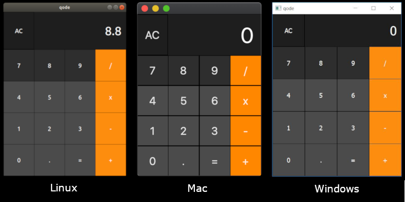

<h1 style="display:inline;"> NodeGui / React Desktop </h1>

An open source library for building cross-platform native desktop applications with JavaScript and CSS like styling.

NodeGui is based on Qt5 and <strong><i>NOT</i></strong> chromium, hence it is memory and cpu efficient.  <strong>React Desktop</strong> is a React renderer for NodeGui.

 

<a href="#/?id=main-doc">
↓
</a>
