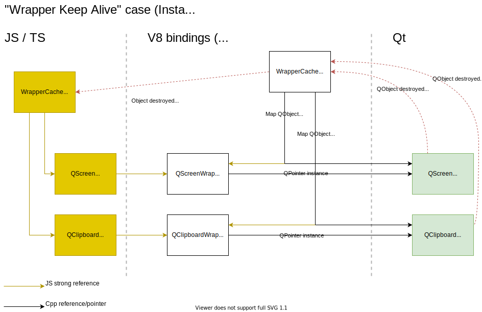
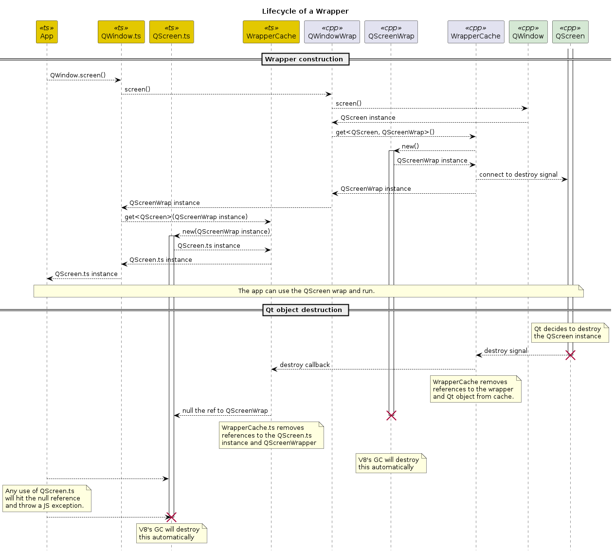

# Wrapper caching and memory management

## "Wrapper Keep Alive" case

The goal of the "Wrapper Keep Alive" case is to maintain and "keep alive" wrappers for the life-time of a `QObject` whose life-cycle is under complete control by Qt itself. i.e. Qt may expose the object, but it creates the instance itself and also destroys it later on. This situation applies to `QScreen` and `QClipboard` for example. A common use case for keeping a wrapper alive is to receive and relay signals from a `QObject` back to JS during the object's life-time.

The WrapperCache (C++) holds strong JS references to the Napi wrapper instances. This keeps them alive. When the core QObject is destroyed the "destroyed" signal is emitted and received by WrapperCache (C++). It then removes the Napi wrapper from its cache and uses a callback function to inform the WrapperCache (JS) about the destruction. WrapperCache (JS) can also perform clean up and null out references to the Napi wrappers. If someone then tries to use a JS side wrapper, then will get a JS side null pointer exception with stacktrace.

**Life-cycle Sequence**

This sequence diagram shows the events when the application calls `QWindow.screen()` to fetch the `QScreen` for the window. The `QScreen` instance is fully created and managed by Qt. Here you can see how the wrapper creation interacts with the JS and C++ side cache classes. You can also see how the wrappers are gracefully shutdown when the core Qt object is destroyed. Any JS side use of the destroyed wrapper / Qt object results in a neat JS side null pointer exception. This is much better than null pointer segfault on the C++ side.

## "Wrapper Recycle" case

A related use case is where we want to "recycle" wrappers and ensure that for a QObject we only have one coresponding JS wrapper active at the same time. For example, repeated calls to `QObject.parent()` should return the same value/object.

Another goal of this use case is to ensure that the unexpected destruction of the underlying QObject is handled in a more graceful and helpful way than just segfaulting the whole application. This requires the tracking of the QObject via its "destroy" signal and using that to communicate back to JS what has happened.

The object creation sequence runs quite differently than in the "Wrapper Keep Alive" case because the application initiates the creation of the object and NodeGui then creates the different wrappers on the JS and C++ sides.

The destruction sequence in the case of the C++ object being destroyed is basically the same as the "Wrapper Keep Alive" case.