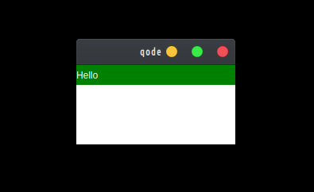

NodeGui uses a layout system to automatically arrange child widgets within a widget to ensure that they make good use of the available space.

## Fixed Dimensions

A widget's height and width determine its size on the screen. The simplest way to set the dimensions of a widget is by adding a fixed width and height to style. Setting dimensions this way is common for widgets that should always render at exactly the same size, regardless of screen dimensions.

```javascript

const { QMainWindow, QWidget } = require("@nodegui/nodegui");

const win = new QMainWindow();
const view = new QWidget(win);

view.setInlineStyle("width:50px; height:30px; background-color: yellow;");

win.show();
(global as any).win = win;

```

## Dynamic Layouts

Dynamic layouts automatically position and resize widgets when the amount of space available for them changes, ensuring that they are consistently arranged and that the user interface as a whole remains usable.

NodeGui currently supports the following layouts at the moment:

- FlexLayout
- QGridLayout

_More layouts will be added as time goes on. You can also add layouts yourself by creating custom native plugins for NodeGui usng the [Custom Native Plugin API.](custom-nodegui-native-plugin.md)_

## FlexLayout

Use FlexLayout to have the children expand and shrink dynamically based on available space. Normally you will use `flex: 1`, which tells a widget to fill all available space, shared evenly amongst other widgets with the same parent. The larger the flex given, the higher the ratio of space a component will take compared to its siblings.

> A widget can only expand to fill available space if its parent has dimensions greater than 0. If a parent does not have either a fixed width and height or flex, the parent will have dimensions of 0 and the flex children will not be visible.

Flexbox is designed to provide a consistent layout on different screen sizes. You will normally use a combination of flexDirection, alignItems, and justifyContent to achieve the right layout.

### Example:

Lets say you want to build a UI that has a parent view which has two child widgets. One a label with text Hello and another a view with background color white. Now you want the label to occupy 1/3 of the available space while the white colored child view to occupy the remaining 2/3 space.



The code for that would look something like this:

```javascript
let { QLabel, FlexLayout, QWidget, QMainWindow } = require("@nodegui/nodegui");

// Create a root view and assign a flex layout to it.
const rootView = new QWidget();
rootView.setLayout(new FlexLayout());
rootView.setObjectName("rootView");

// Create two widgets - one label and one view
const label = new QLabel();
label.setText("Hello");
label.setObjectName("label");

const view = new QWidget();
view.setObjectName("view");

// Now tell rootView layout that the label and the other view are its children
rootView.layout.addWidget(label);
rootView.layout.addWidget(view);

// Tell FlexLayout how you want children of rootView to be poisitioned
rootView.setStyleSheet(`
  #rootView{
    flex: 1;
    background-color: blue;
  }
  #label {
   flex: 1;
   color: white;
   background-color: green;
  }
  #view {
    flex: 3;
    background-color: white;
  }
`);

const win = new QMainWindow();
win.setCentralWidget(rootView);
win.show();
global.win = win;
```

### TLDR

- First step is to set a layout on the parent widget. You can do this using the widget's `setLayout` method. Here we are using FlexLayout.

- For a layout to work you must let the layout know which widgets are the children and how to lay them on the available screen space within the parent widget. You do this using a layout's `addWidget` method. In the case of FlexLayout you will specify properties by setting flex properties on the parent and child widgets.

> To know more on how FlexBox layout works in depth you can visit: https://facebook.github.io/react-native/docs/0.60/flexbox.
>
> NodeGui uses the same library that React Native uses underneath for FlexBox ([Yoga](https://github.com/facebook/yoga)).

- You can specify layout properties via inline styles also.

## Conclusion

The primary layout in NodeGui is the Flexbox layout. Flexbox layout can be controlled via stylesheet just as in web. So both paint and layout properties are available at the same place.

NodeGui will also try to support other available layouts in Qt. But, If you need a special layout that Qt/NodeGui doesnt yet support you can always create a [native plugin for NodeGui](custom-nodegui-native-plugin.md) and use Qt's APIs to create one. In fact, Qt doesnt have a FlexLayout built in, FlexLayout is actually a custom Qt layout written with the help of Yoga library.
